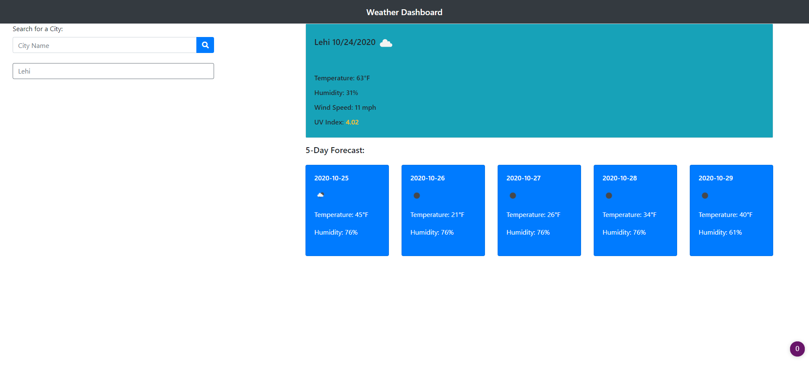

# Tuck-Weather-Dashboard README

## Requirements
* Build a simple weather application
* This app will run in the browser
* Use the OpenWeather API to retrieve weather data for cities
* Show current and future conditions for a searched city and add it to the search history
* Display city name, the date, an icon representation of weather conditions, the temperature, the humidity, the wind speed, and the UV index
* Use color to show if the UV index is favorable, moderate, or severe
* Display 5-day forecast with the date, an icon representation of weather conditions, the temperature, and the humidity
* Click on a city in the search history and show current and future conditions for that city
* On subsequent opens display last searched city forecast

## Files & directories

* index&#46;html

* script&#46;js

* style&#46;css

* README&#46;md

## Links

#####[Link to webpage](https://jamesjtuckbc.github.io/Tuck-Weather-Dashboard/)
#####[Link to repo](https://github.com/jamesjtuckbc/Tuck-Weather-Dashboard)
### Pages

#### index.html

## License

The MIT License (MIT)

Copyright (c) 2020 Jorgen Tuck

Permission is hereby granted, free of charge, to any person obtaining a copy of this software and associated documentation files (the "Software"), to deal in the Software without restriction, including without limitation the rights to use, copy, modify, merge, publish, distribute, sublicense, and/or sell copies of the Software, and to permit persons to whom the Software is furnished to do so, subject to the following conditions:

The above copyright notice and this permission notice shall be included in all copies or substantial portions of the Software.

THE SOFTWARE IS PROVIDED "AS IS", WITHOUT WARRANTY OF ANY KIND, EXPRESS OR IMPLIED, INCLUDING BUT NOT LIMITED TO THE WARRANTIES OF MERCHANTABILITY, FITNESS FOR A PARTICULAR PURPOSE AND NONINFRINGEMENT. IN NO EVENT SHALL THE AUTHORS OR COPYRIGHT HOLDERS BE LIABLE FOR ANY CLAIM, DAMAGES OR OTHER LIABILITY, WHETHER IN AN ACTION OF CONTRACT, TORT OR OTHERWISE, ARISING FROM, OUT OF OR IN CONNECTION WITH THE SOFTWARE OR THE USE OR OTHER DEALINGS IN THE SOFTWARE.
- - -

© 2020 Jorgen Tuck
